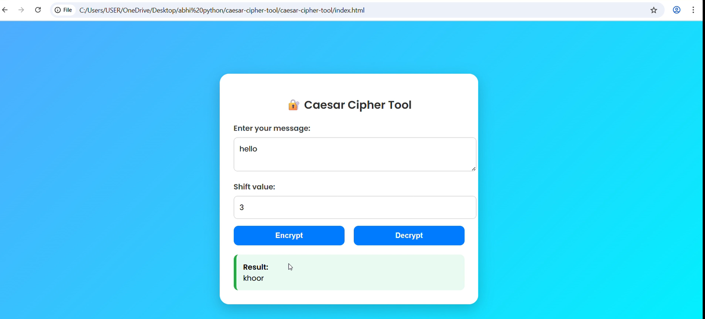

# 🔐 Caesar Cipher Web App

This is a web app that encrypts and decrypts text using the Caesar Cipher algorithm.

## 🚀 Features
- Encrypt and decrypt messages
- Supports custom shift values
- Simple and clean interface

## 📸 Screenshot

## 📁 Project Files
- `index.html`: Main website file
- `README.md`: This file
- `images/screenshot.png`: Your app's screenshot

## 👨‍💻 How to Use
1. Open `index.html` in your browser
2. Enter your message and shift value
3. Click "Encrypt" or "Decrypt"

## 🌐 Live Website
https://abhinandpv10.github.io/caesar-cipher-tool/
## 📚 Author
Created by [Abhinand krishnan P V]
